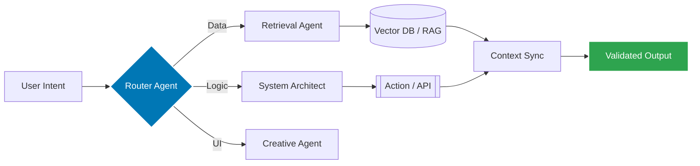
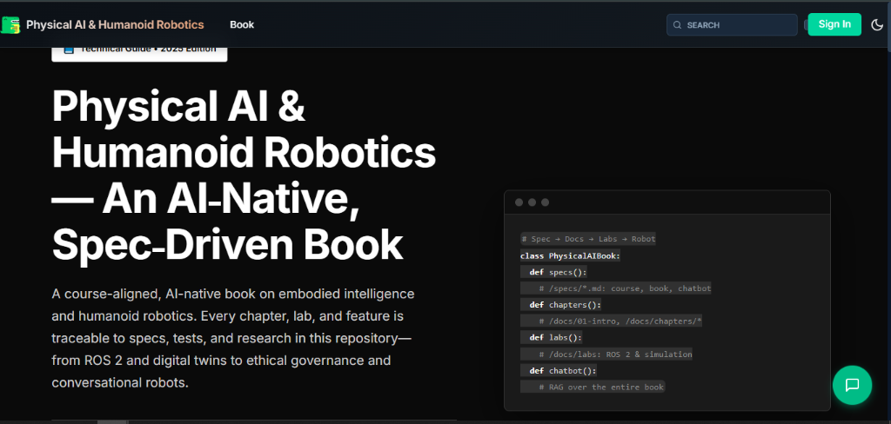
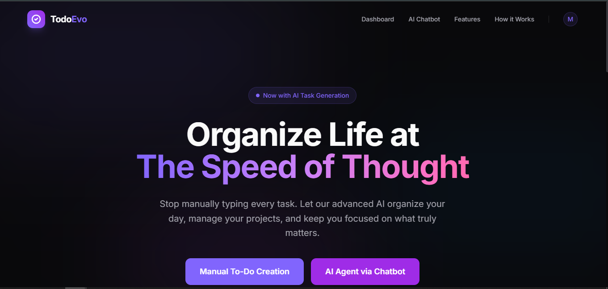
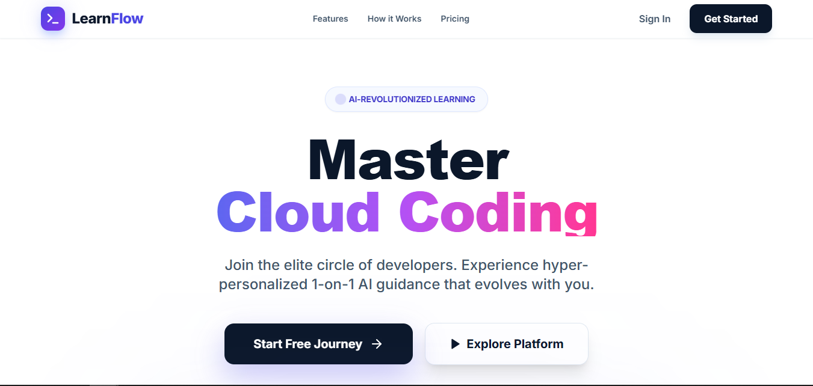
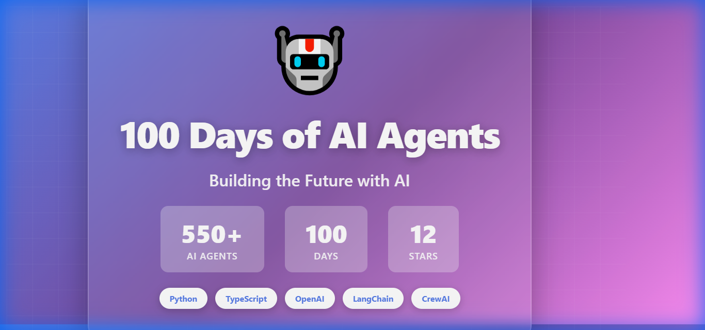
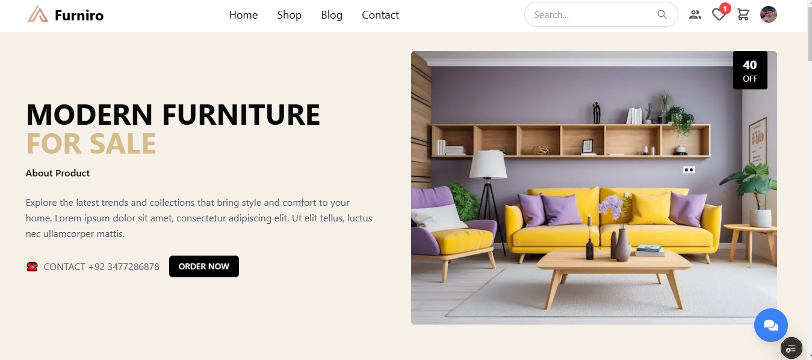
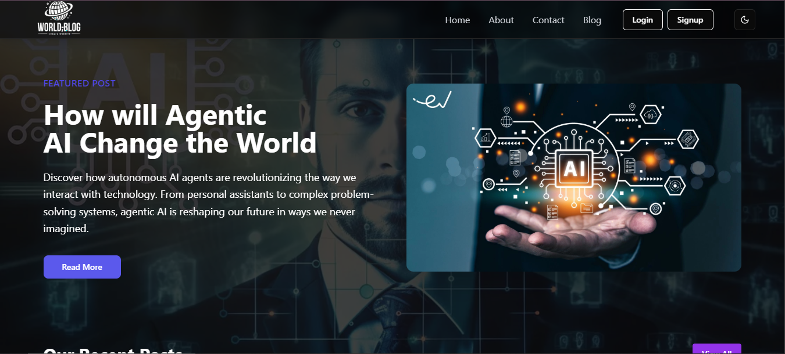
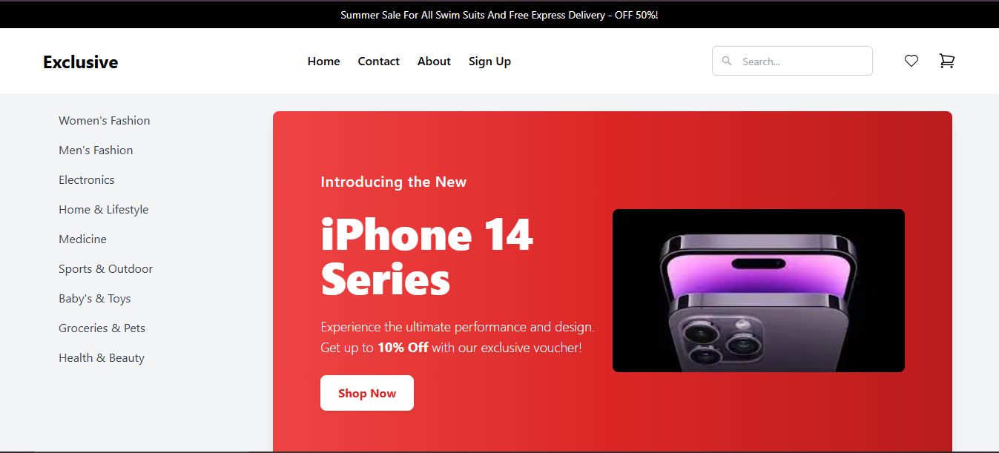

# 🌌 Muhammad Sami Asghar Mughal
### AI Agent Engineer & Full-Stack Architect

  
  
   

  [🌐 **Live Portfolio**](https://muhammad-sami.vercel.app/) • [📄 **Web Resume**](https://muhammad-sami-resume.vercel.app/) • [📥 **PDF Resume**](public/resume.pdf)
  
   

  
  
  
  

  

---

## 🛰️ Professional Mission
> *"I do not build software; I engineer autonomous intelligence. My work bridges the gap between high-frequency web architectures and Generative AI to create systems that don't just process data, but understand intent."*

---

## 🛠️ Technical Ecosystem

  

 

<table align="center" width="100%">
  <tr>
    <td width="33.33%" valign="top">
      <h3>🧬 Intelligence</h3>
      <ul>
        <li>Autonomous Agents</li>
        <li>RAG Architectures</li>
        <li>MCP Protocols</li>
        <li>LLM Fine-tuning</li>
      </ul>
    </td>
    <td width="33.33%" valign="top">
      <h3>🏛️ Architecture</h3>
      <ul>
        <li>Next.js 15 / React 19</li>
        <li>Python Ecosystem</li>
        <li>Distributed Systems</li>
        <li>Micro-Frontends</li>
      </ul>
    </td>
    <td width="33.33%" valign="top">
      <h3>⚡ Performance</h3>
      <ul>
        <li>Partial Prerendering</li>
        <li>Core Web Vitals</li>
        <li>Serverless Logic</li>
        <li>Edge Computing</li>
      </ul>
    </td>
  </tr>
</table>

---

## 📐 Agentic Workflow Architecture
*Strategic blueprint for Multi-Agent Orchestration and Context Preservation.*

---

## 🏆 Hackathon Victories
*Technical benchmarks set across the PIAIC ecosystem, recognized for architectural depth and agentic innovation.*

<table width="100%">
  <tr>
    <td width="33.33%" align="center" valign="top">
      <a href="https://muhammad-sami.vercel.app/hackathon/physical-ai-humanoid-robotics-textbook">
        
         
        <b>🥇 Physical AI & Robotics</b>
      </a>
      
<small><b>1st Place Submission</b>. Integrated RAG Chatbot & ROS 2 simulations.</small>

    </td>
    <td width="33.33%" align="center" valign="top">
      <a href="https://muhammad-sami.vercel.app/hackathon/cloud-native-ai-todo-platform">
        
         
        <b>🏆 Cloud-Native AI Todo</b>
      </a>
      
<small><b>Hackathon II Winner</b>. Kubernetes-managed, event-driven architecture.</small>

    </td>
    <td width="33.33%" align="center" valign="top">
      <a href="https://muhammad-sami.vercel.app/hackathon/learnflow-ai-platform">
        
         
        <b>🎖️ LearnFlow AI Platform</b>
      </a>
      
<small><b>Hackathon III Winner</b>. Agentic infra with MCP code execution.</small>

    </td>
  </tr>
</table>

---

## 📂 Project Showcase Arena

<table width="100%">
  <tr>
    <td width="33.33%" align="center" valign="top">
      <a href="https://github.com/muhammadsami987123/100DaysOfAI-Agents">
        
         
        <b>🤖 100 Days of AI Agents</b>
      </a>
      
<small>550+ autonomous entities engineered for industrial automation.</small>

    </td>
    <td width="33.33%" align="center" valign="top">
      <a href="https://hackthone-two.vercel.app/">
        
         
        <b>🛋️ Furniture E-Commerce</b>
      </a>
      
<small>Next.js 15 commerce engine with 0.4s load times.</small>

    </td>
    <td width="33.33%" align="center" valign="top">
      <a href="https://blogwebsite-gray.vercel.app/">
        
         
        <b>✍️ AI Blog Ecosystem</b>
      </a>
      
<small>Modern content hub with automated SEO orchestration.</small>

    </td>
  </tr>
  <tr>
    <td width="33.33%" align="center" valign="top">
      <a href="https://ecommerceadmindashboard-puce.vercel.app/">
        
         
        <b>🎛️ Neural Admin Panel</b>
      </a>
      
<small>Multi-tenant SaaS dashboard for real-time analytics.</small>

    </td>
    <td width="33.33%" align="center" valign="top">
      <a href="https://e-commerce--exclusive.vercel.app/">
        
         
        <b>📊 Electronics Market</b>
      </a>
      
<small>Algorithmic product discovery & inventory system.</small>

    </td>
    <td width="33.33%" align="center" valign="top">
      <a href="https://muhammad-sami-resume.vercel.app/">
        
         
        <b>💼 Interactive Resume</b>
      </a>
      
<small>Fully responsive, logic-driven web-based CV.</small>

    </td>
  </tr>
</table>

---

## 🧬 System Optimizations & Logic

### **The Multi-Agent Persistence Layer**
In complex autonomous workflows, maintaining state across multiple agents is a critical bottleneck. I architected a **Vector-Based Short-Term Memory** protocol that allows agents to selectively recall mission-critical context. 
*   **Result:** Reduced token overhead by **40%** while increasing factual precision in long-form tasks.

### **Next.js 15 Partial Prerendering (PPR)**
I utilize PPR to bridge the gap between static load performance and dynamic AI delivery. By isolating high-frequency UI components from heavy AI streams, I maintain an **LCP score in the top 1%** of modern web applications.

---

## ⌚ Professional Timeline

- **Founder & Lead Engineer** | `CodePulse Innovations` (2025 – Present)
- **AI Agent Architect** | `Independent Research` (2024 – Present)
- **Full Stack Consultant** | `Global Markets` (2023 – Present)
- **Web Applications Developer** | `Freelance Architecture` (2020 – 2022)

---

## 📊 Performance Intelligence

  
  

   
  

---

  
  

    <b>© 2025 | Muhammad Sami Mughal</b>  
    <a href="https://muhammad-sami.vercel.app/">Portfolio</a> • <a href="https://muhammad-sami-resume.vercel.app/">Web Resume</a> • <a href="public/resume.pdf">PDF Resume</a>
  

